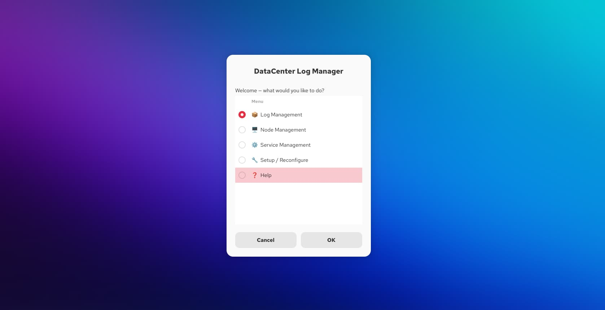

<div align="center">

# 🖥️ DataCenter Log Manager

[](https://opensource.org/licenses/MIT)
[](test_datacenter_log_manager.sh)
[](https://www.gnu.org/software/bash/)
[](https://help.gnome.org/users/zenity/stable/)
[]()

</div>

---

## 📸 Screenshots

| Main Menu | Log Collection | Connectivity Report |
|:---:|:---:|:---:|
|  |  |  |

| Node Info | Service Management | FTP Upload |
|:---:|:---:|:---:|
|  |  |  |

> _Click images to enlarge_
---

## 🎯 Problem It Solves

In multi-shift data center environments, operators frequently need to run the same set of commands against tens of nodes — collecting logs, verifying services, checking connectivity, uploading archives. Doing this manually via terminal introduces:

- **Typing errors** in node names, IP addresses, and remote paths
- **Inconsistency** between operators with different experience levels
- **No validation** before commands execute against live infrastructure

This tool wraps all of those workflows into a validated, menu-driven GUI. Every input is checked before any command runs. Operators click instead of type.

---

## 🚀 Features

- **First-run Setup Wizard** — interactive configuration on first launch; no manual file editing required
- **Log Collection** — collects logs from individual or all nodes via SSH; compresses into `.tar.gz` archives organized by ticket/job ID
- **FTP Upload** — uploads staged archives to a central server; single node or full batch
- **Collect & Upload** — one-shot workflow: collect from all nodes and upload in a single operation
- **Connectivity Check** — pings all configured nodes and generates a reachability report
- **Node Hardware Info** — pulls hostname, uptime, CPU, memory, disk, and network details via SSH
- **Node Scan** — scans all nodes in the configured range and shows a status summary
- **Service Management** — verifies configured services are running; starts stopped ones automatically; restart individually on demand
- **Live Log Tail** — opens a live `tail -f` session for any log file in a new terminal
- **Input Validation** — all entries (ticket IDs, node names, IP addresses) are validated before any command executes
- **Zero hardcoded credentials** — all sensitive data lives in an external config file (`600` permissions)

---

## 🛠️ Tech Stack

| Component | Technology |
|---|---|
| Language | Bash (POSIX-compatible) |
| GUI | Zenity (GTK dialog toolkit) |
| Remote operations | SSH (OpenSSH) |
| File transfer | cURL (FTP) |
| Compression | tar + gzip |
| Service management | systemctl |
| Testing | Bash unit tests with mocked dependencies |

---

## 📁 Project Structure

```
datacenter-log-manager/
├── datacenter_log_manager.sh      # Main script
├── test_datacenter_log_manager.sh # Unit test suite (36 tests, no GUI required)
├── settings.conf.example          # Config template — copy to ~/.config/dclogmanager/
└── README.md
```

**Config file location:** `~/.config/dclogmanager/settings.conf`
Never committed to version control — see `.gitignore`.

---

## ⚙️ Installation

### Requirements

- Linux with a desktop environment (GNOME or compatible)
- `zenity`, `curl`, `tar`, `ssh`, `ping`, `systemctl`

### Install dependencies

```bash
# Ubuntu / Debian
sudo apt install zenity openssh-client curl

# Fedora / RHEL
sudo dnf install zenity openssh-clients curl
```

### Setup

```bash
# 1. Clone the repository
git clone https://github.com/fmartinez-cli/datacenter-log-manager.git
cd datacenter-log-manager

# 2. Make the script executable
chmod +x datacenter_log_manager.sh

# 3. Run — the setup wizard launches automatically on first run
./datacenter_log_manager.sh
```

The wizard will prompt for:
- FTP server host, username, and password
- SSH username for remote nodes
- Node naming prefix and range (e.g. `node`, `1` to `40`)
- Services to monitor (comma-separated)

All values are saved to `~/.config/dclogmanager/settings.conf` with `chmod 600` automatically applied.

---

## 🔧 Manual Configuration

If you prefer to configure manually instead of using the wizard:

```bash
mkdir -p ~/.config/dclogmanager
cp settings.conf.example ~/.config/dclogmanager/settings.conf
chmod 600 ~/.config/dclogmanager/settings.conf
nano ~/.config/dclogmanager/settings.conf
```

### Available configuration variables

| Variable | Description | Example |
|---|---|---|
| `FTP_HOST` | FTP server hostname or IP | `192.168.1.100` |
| `FTP_USER` | FTP username | `logadmin` |
| `FTP_PASS` | FTP password | `yourpassword` |
| `FTP_REMOTE_PATH` | Remote base path for uploads | `/logs` |
| `SSH_USER` | SSH username for node access | `admin` |
| `NODE_PREFIX` | Node name prefix | `node` |
| `NODE_START` | First node number | `1` |
| `NODE_END` | Last node number | `40` |
| `SERVICES` | Comma-separated services to monitor | `ssh,cron,rsyslog` |
| `HELP_URL` | URL opened by the Help option | `https://...` |

---

## 📋 Menu Structure

```
Main Menu
├── 📦 Log Management
│   ├── Collect logs from single node
│   ├── Collect logs from all nodes
│   ├── Upload staged logs to FTP
│   ├── Collect & Upload all nodes       ← one-shot full workflow
│   └── Tail a log file
│
├── 🖥️  Node Management
│   ├── Ping a node
│   ├── Check all nodes connectivity
│   ├── Show node hardware info
│   └── Scan all nodes info
│
├── ⚙️  Service Management
│   ├── Verify and start all services
│   └── Restart a single service
│
├── 🔧 Setup / Reconfigure
└── ❓ Help
```

---

## 🧪 Running Tests

The test suite covers all non-GUI functions and runs headlessly — no display or live infrastructure required.

```bash
bash test_datacenter_log_manager.sh
```

**Current coverage: 36 tests, 0 failures**

```
▶ validate_ticket_id       10 tests
▶ validate_node_name        7 tests
▶ validate_ip               9 tests
▶ collect_node_logs         2 tests  (mocked SSH)
▶ Configuration file        7 tests
▶ Script syntax             1 test
```

All external dependencies (`zenity`, `ssh`, `systemctl`, `curl`) are mocked so tests run safely without touching any real systems.

---

## 🔒 Security

- **No credentials in source code** — all sensitive values live in an external config file outside the repository
- **Config file permissions** — automatically set to `600` (owner read/write only) by the setup wizard
- **Input validation before execution** — ticket IDs, node names, and IP addresses are validated with strict patterns before any SSH, curl, or system command runs
- **SSH with timeout** — all SSH calls use `ConnectTimeout=10` and `BatchMode=yes` to prevent hanging on unreachable nodes

Add to your `.gitignore`:
```
settings.conf
```

---
## 🗺️ Roadmap

### v2.0 (Current)
- ✅ Core log collection and upload
- ✅ Service management
- ✅ Node hardware info

### v2.1 (Planned)
- 🔄 Parallel node operations (faster collection)
- 🔄 Email notifications on completion
- 🔄 Configuration profiles (dev/staging/prod)

### v3.0 (Future)
- 📅 Web interface alternative to Zenity
- 📅 REST API for integration
- 📅 Dashboard with historical data

---
## 🤝 Contributing

Pull requests are welcome. For major changes, please open an issue first.

1. Fork the repository
2. Create a feature branch (`git checkout -b feature/my-feature`)
3. Add tests for any new validation or core logic
4. Commit (`git commit -m 'feat: description'`)
5. Push and open a Pull Request

---

## 📄 License

This project is licensed under the [MIT License](LICENSE).

---

## 👨‍💻 Author

**Fernando Martinez Barbosa**
- LinkedIn: [linkedin.com/in/your-profile](https://linkedin.com/in/your-profile)
- GitHub: [@fmartinez-cli](https://github.com/fmartinez-cli)

---

> _Built from a real operational need: giving multi-shift data center operators a consistent, error-free way to collect and upload logs — regardless of their command-line experience level._
